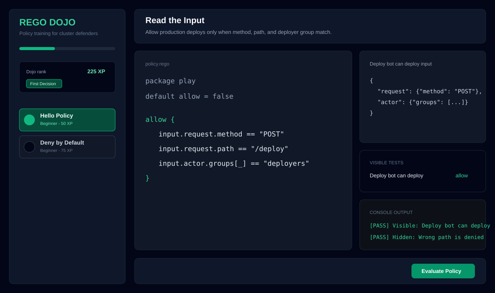
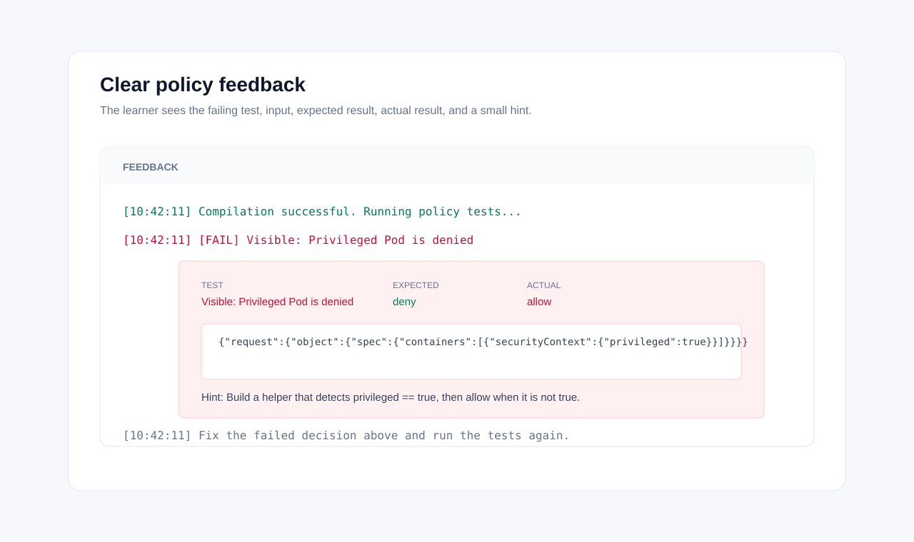

# Rego Dojo

Rego Dojo is a browser-based training game for Open Policy Agent policies. It is built around a short, winnable first session and a practical Kubernetes admission-control curriculum.



## What is inside

- A tight first path: Hello Policy, Deny by Default, Read the Input, then a real privileged-container admission example.
- Structured level authoring with `prompt`, `starterPolicy`, `visibleTests`, `hiddenTests`, `hints`, and `successExplanation`.
- Exact evaluation feedback for failed tests: failing test name, JSON input, expected decision, actual decision, and a targeted hint.
- Kubernetes security curriculum: privileged containers, required labels, pinned image tags, resource limits, hostPath restrictions, approved registries, and a combined Pod baseline.
- Tasteful progress layer: points, streaks, unlocks, milestones, a learning path, and shareable completion links.
- OPA WASM evaluation in the browser with a small Go compile API.



## One-command local run

Prerequisites:

- Node.js 18+
- Go 1.24+

```bash
npm install
npm run local
```

Open [http://localhost:3000](http://localhost:3000). The local command starts both:

- Frontend: Vite on `http://localhost:3000`
- Backend: Go compile API on `http://localhost:8080`

## Other run paths

Vercel-style local development:

```bash
vercel dev
```

Docker:

```bash
docker compose up --build
```

Then open [http://localhost:3000](http://localhost:3000).

## Tests and build

```bash
npm test
go test ./...
npm run build
```

## Level authoring

Levels live in [`src/levels`](src/levels). Each level is a typed object:

```ts
import type { Level } from '../lib/types';

export const level: Level = {
  id: 'example_id',
  title: 'Example title',
  prompt: 'The mission the learner is solving.',
  difficulty: 'Beginner',
  campaign: 'kubernetes-basics',
  xp: 125,
  starterPolicy: `package play

default allow = false`,
  visibleTests: [
    {
      name: 'Allowed case',
      input: { request: { action: 'deploy' } },
      expectedResult: true,
      hint: 'Point the learner at the field they missed.'
    }
  ],
  hiddenTests: [
    {
      name: 'Edge case',
      input: { request: { action: 'delete' } },
      expectedResult: false,
      hint: 'Explain the smallest next move.'
    }
  ],
  hints: ['General hint shown from the footer button.'],
  successExplanation: 'A short explanation of what the learner just mastered.'
};
```

Visible tests are shown before evaluation. Hidden tests are not shown up front, but any hidden failure reveals the exact input and hint so the learner can recover without guessing.

## Deployment

Vercel:

```bash
npm run build
vercel deploy
```

Docker Compose:

```bash
docker compose up --build
```

The frontend container serves the built app through Nginx and proxies `/api` to the backend container.

## Project structure

```plaintext
rego-dojo/
├── api/                  # Vercel Go function for Rego -> WASM compilation
├── cmd/server/           # Local Go API server
├── docs/screenshots/     # README screenshots
├── scripts/local-dev.mjs # One-command local stack
├── src/components/       # React UI
├── src/levels/           # Authored curriculum
├── src/lib/              # OPA runtime, types, progress helpers
└── src/store/            # Zustand game progress
```

License: MIT
